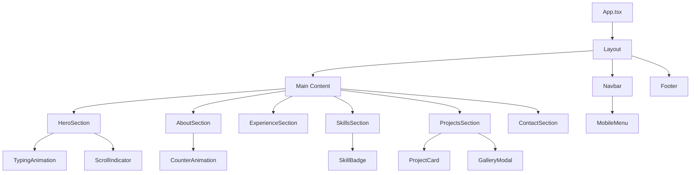
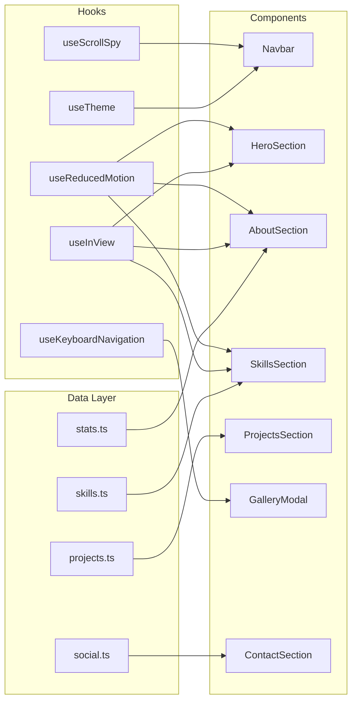

# Design Document: Portfolio UI Upgrade

## Overview

This design document describes the technical architecture for transforming the current monolithic ~900-line `App.tsx` portfolio application into a modular, component-based architecture with enhanced UI/UX features. The upgrade preserves all existing content and functionality while introducing dynamic interactions, improved responsive design, accessibility compliance, and a polished theme system.

The application uses React 19, TypeScript, Vite 7, Tailwind CSS 4, Framer Motion, and react-icons. The refactoring introduces no new runtime dependencies — all enhancements are achieved through better architecture and leveraging existing libraries more effectively.

### Key Design Decisions

1. **Component decomposition by section** — Each portfolio section becomes its own component file, keeping files under 200 lines and enabling independent development.
2. **Shared data layer** — All project data, skill data, and type definitions live in dedicated modules under `src/data/` and `src/types/`.
3. **Animation system centralization** — Framer Motion variants and animation utilities are extracted to `src/lib/animations.ts` for consistency and reuse.
4. **Custom hooks for cross-cutting concerns** — Theme management, scroll-spy, intersection observer, and keyboard navigation are encapsulated in reusable hooks.
5. **No new runtime dependencies** — The existing stack (React 19, Framer Motion, react-icons, Tailwind CSS 4) is sufficient for all requirements.

---

## Architecture

### High-Level Component Tree



### Directory Structure

```
src/
├── components/
│   ├── layout/
│   │   ├── Navbar.tsx            # Fixed navigation bar with scroll-spy
│   │   ├── MobileMenu.tsx        # Hamburger-triggered mobile drawer
│   │   ├── Footer.tsx            # Copyright and analytics
│   │   └── SectionDivider.tsx    # Gradient transition between sections
│   ├── sections/
│   │   ├── HeroSection.tsx       # Landing area with typing animation
│   │   ├── AboutSection.tsx      # Bio, stats, education
│   │   ├── ExperienceSection.tsx # Work history timeline
│   │   ├── SkillsSection.tsx     # Filterable skill grid
│   │   ├── ProjectsSection.tsx   # Filterable project cards
│   │   └── ContactSection.tsx    # Social links and CTA
│   └── ui/
│       ├── TypingAnimation.tsx   # Cycling role text effect
│       ├── ScrollIndicator.tsx   # Animated down-arrow
│       ├── CounterAnimation.tsx  # Animated number counter
│       ├── SkillBadge.tsx        # Individual skill pill with tooltip
│       ├── ProjectCard.tsx       # Project card with 3D tilt
│       ├── GalleryModal.tsx      # Full-screen image gallery
│       └── ImageWithFallback.tsx # Image with error placeholder
├── hooks/
│   ├── useTheme.ts              # Dark/light mode management
│   ├── useScrollSpy.ts          # Active section detection
│   ├── useInView.ts             # Intersection observer wrapper
│   ├── useKeyboardNavigation.ts # Gallery keyboard controls
│   └── useReducedMotion.ts      # prefers-reduced-motion detection
├── lib/
│   ├── animations.ts            # Framer Motion variants & utilities
│   └── constants.ts             # App-wide constants (breakpoints, durations)
├── data/
│   ├── projects.ts              # projectsData array
│   ├── skills.ts                # Skills organized by category
│   ├── social.ts                # Social media links
│   └── stats.ts                 # About section statistics
├── types/
│   └── index.ts                 # ProjectData, PhotoContext, SkillData, etc.
├── App.tsx                      # Root component (minimal orchestration)
├── App.css                      # Minimal custom CSS (replaced by Tailwind)
├── index.css                    # Tailwind imports and theme config
└── main.tsx                     # React entry point
```

### Data Flow



---

## Components and Interfaces

### Core Type Definitions (`src/types/index.ts`)

```typescript
export interface PhotoContext {
  url: string;
  caption: string;
  tools: string;
}

export interface ProjectData {
  id: string;
  title: string;
  shortDesc: string;
  category: string;
  techStack: string[];
  thumbnail: string;
  photos: PhotoContext[];
  githubUrl?: string;
  demoUrl?: string;
}

export interface SkillData {
  name: string;
  icon: React.ReactNode;
  level: 'expert' | 'intermediate' | 'familiar';
  yearsOfExperience?: number;
}

export interface SkillCategory {
  id: string;
  name: string;
  icon: React.ReactNode;
  accentColor: string;
  skills: SkillData[];
}

export interface SocialLink {
  platform: string;
  url: string;
  icon: React.ReactNode;
  hoverColor: string;
}

export interface StatItem {
  label: string;
  value: number;
  suffix?: string;
}

export type Theme = 'light' | 'dark';
```

### Custom Hooks

#### `useTheme`
```typescript
interface UseThemeReturn {
  theme: Theme;
  toggleTheme: () => void;
  isDark: boolean;
}
```
- Reads initial theme from `localStorage` key `color-theme` or system preference
- Applies `dark` class to `document.documentElement`
- Persists selection to `localStorage`

#### `useScrollSpy`
```typescript
interface UseScrollSpyOptions {
  sectionIds: string[];
  offset?: number;       // navbar height offset
  threshold?: number;    // viewport percentage (default 0.5)
}

interface UseScrollSpyReturn {
  activeSection: string;
}
```
- Uses IntersectionObserver with `rootMargin` calculated from navbar height
- Updates active section when section crosses 50% viewport threshold
- Returns the currently active section ID

#### `useInView`
```typescript
interface UseInViewOptions {
  once?: boolean;        // default true
  threshold?: number;    // default 0.15
  rootMargin?: string;
}

interface UseInViewReturn {
  ref: React.RefObject<HTMLElement>;
  isInView: boolean;
}
```
- Wraps IntersectionObserver for triggering entrance animations
- Falls back to always-visible state if IntersectionObserver is unavailable

#### `useKeyboardNavigation`
```typescript
interface UseKeyboardNavigationOptions {
  isActive: boolean;
  totalItems: number;
  onNavigate: (index: number) => void;
  onClose: () => void;
}
```
- Listens for ArrowLeft, ArrowRight, Escape when active
- Handles circular wrap-around navigation
- Cleans up event listeners on unmount

#### `useReducedMotion`
```typescript
function useReducedMotion(): boolean;
```
- Returns `true` if `prefers-reduced-motion: reduce` is active
- Used to conditionally disable transform animations

### Component Props Interfaces

```typescript
// Navbar
interface NavbarProps {
  sections: { id: string; label: string }[];
}

// HeroSection — no props, uses data imports directly

// AboutSection — no props, uses data imports directly

// SkillsSection — no props, uses data imports directly

// ProjectsSection
interface ProjectsSectionProps {
  onOpenGallery: (project: ProjectData) => void;
}

// ProjectCard
interface ProjectCardProps {
  project: ProjectData;
  onExploreGallery: () => void;
}

// GalleryModal
interface GalleryModalProps {
  project: ProjectData;
  onClose: () => void;
}

// SkillBadge
interface SkillBadgeProps {
  skill: SkillData;
  accentColor: string;
  index: number;
}

// CounterAnimation
interface CounterAnimationProps {
  target: number;
  suffix?: string;
  duration?: number;  // default 2000ms
  isInView: boolean;
}

// TypingAnimation
interface TypingAnimationProps {
  roles: string[];
  typingSpeed?: number;   // ms per character
  pauseDuration?: number; // ms to hold each role (2000-4000)
}

// ImageWithFallback
interface ImageWithFallbackProps {
  src: string;
  alt: string;
  className?: string;
  placeholderClassName?: string;
}
```

---

## Data Models

### Projects Data (`src/data/projects.ts`)

Exports the existing `projectsData` array typed as `ProjectData[]`. Each project includes an optional `githubUrl` and `demoUrl` field for conditional link rendering.

### Skills Data (`src/data/skills.ts`)

Restructures the current inline skill arrays into a typed `SkillCategory[]` export:

```typescript
export const skillCategories: SkillCategory[] = [
  {
    id: 'software-backend',
    name: 'Software & Backend Development',
    icon: <FaLaptopCode />,
    accentColor: 'teal',
    skills: [
      { name: 'Python', icon: <FaPython />, level: 'expert', yearsOfExperience: 4 },
      // ...
    ]
  },
  // ... 7 more categories
];
```

### Social Links Data (`src/data/social.ts`)

```typescript
export const socialLinks: SocialLink[] = [
  { platform: 'LinkedIn', url: 'https://...', icon: <FaLinkedin />, hoverColor: '#0077b5' },
  { platform: 'Instagram', url: 'https://...', icon: <FaInstagram />, hoverColor: '#E4405F' },
  { platform: 'Email', url: 'mailto:athifadheel@gmail.com', icon: <FaEnvelope />, hoverColor: '#EA4335' },
];
```

### Statistics Data (`src/data/stats.ts`)

```typescript
export const stats: StatItem[] = [
  { label: 'Projects Completed', value: 10, suffix: '+' },
  { label: 'Technologies Mastered', value: 40, suffix: '+' },
  { label: 'Years of Experience', value: 3, suffix: '+' },
];
```

### Animation Variants (`src/lib/animations.ts`)

Centralizes all Framer Motion variants:

```typescript
import type { Variants } from 'framer-motion';

export const fadeInUp: Variants = {
  hidden: { opacity: 0, y: 30 },
  visible: { opacity: 1, y: 0, transition: { duration: 0.6, ease: 'easeOut' } }
};

export const staggerContainer: Variants = {
  hidden: { opacity: 0 },
  visible: { opacity: 1, transition: { staggerChildren: 0.15 } }
};

export const scaleUp: Variants = {
  hidden: { opacity: 0, scale: 0.9 },
  visible: { opacity: 1, scale: 1, transition: { duration: 0.5 } }
};

export const slideIn: Variants = {
  hidden: { opacity: 0, x: -20 },
  visible: { opacity: 1, x: 0, transition: { duration: 0.4, ease: 'easeOut' } }
};

// Reduced motion variants (opacity only, max 200ms)
export const reducedMotionVariants: Variants = {
  hidden: { opacity: 0 },
  visible: { opacity: 1, transition: { duration: 0.2 } }
};
```

---

## Correctness Properties

*A property is a characteristic or behavior that should hold true across all valid executions of a system — essentially, a formal statement about what the system should do. Properties serve as the bridge between human-readable specifications and machine-verifiable correctness guarantees.*

### Property 1: Scroll-spy active state correctness

*For any* section that occupies the top 50% of the viewport, the navigation bar SHALL mark exactly one link as active, and that link's target SHALL correspond to the visible section's ID.

**Validates: Requirements 3.2**

### Property 2: Anchor link navigation correctness

*For any* internal navigation link clicked (either in the navbar or elsewhere), the viewport SHALL scroll to position the target section at an offset equal to the navbar height plus padding, such that the section heading is not obscured.

**Validates: Requirements 3.4, 9.4**

### Property 3: Counter animation target accuracy

*For any* statistic item with a numeric target value, when the counter animation completes (after 2 seconds), the displayed value SHALL equal the target value exactly.

**Validates: Requirements 4.1**

### Property 4: Skills category filter correctness

*For any* category filter selection, all visible skill badges SHALL belong to the selected category; when "All" is selected, all skills from all categories SHALL be visible.

**Validates: Requirements 5.1**

### Property 5: Skill badge tooltip data correctness

*For any* skill badge on a viewport ≥ 1024px, hovering SHALL display a tooltip containing either the years of experience or the proficiency level label from the skill's data source.

**Validates: Requirements 5.3**

### Property 6: Skill visual hierarchy correctness

*For any* skill in the data source, if it has `level === 'expert'` or `yearsOfExperience >= 3`, it SHALL render with full opacity (1.0) and a highlighted border; otherwise it SHALL render with reduced opacity (between 0.6 and 0.8) and a default border.

**Validates: Requirements 5.4**

### Property 7: Project card hover overlay correctness

*For any* project card, the hover overlay SHALL display the project's category string and a tagline (shortDesc) truncated to no more than 80 characters.

**Validates: Requirements 6.1**

### Property 8: Project card link conditional rendering

*For any* project in the data source, if `githubUrl` or `demoUrl` is defined and non-empty, a link element SHALL render pointing to that URL; if neither is defined, no link element SHALL be present in the card.

**Validates: Requirements 6.3**

### Property 9: Projects category filter correctness

*For any* project category filter selection, all visible project cards SHALL have a `category` matching the selected filter; when "All" is selected, all projects SHALL be visible. If no projects match, an empty-state message SHALL be displayed.

**Validates: Requirements 6.5, 6.7**

### Property 10: Gallery keyboard navigation with circular wrap

*For any* gallery of size N, pressing the right arrow key at index N-1 SHALL navigate to index 0, and pressing the left arrow key at index 0 SHALL navigate to index N-1. Pressing Escape SHALL close the modal.

**Validates: Requirements 7.1, 7.2**

### Property 11: Gallery position indicator accuracy

*For any* gallery of size N at current index i, the position indicator SHALL display the string `"${i+1} / ${N}"`.

**Validates: Requirements 7.9**

### Property 12: Social link rendering completeness

*For any* social link in the data source, the rendered element SHALL contain: an icon element, a visible text label matching the platform name, an `href` matching the URL, `target="_blank"`, and `rel="noopener noreferrer"`.

**Validates: Requirements 8.2, 8.6**

### Property 13: Theme persistence round-trip

*For any* theme selection (light or dark), after toggling the theme and simulating a page reload, the applied theme class on `documentElement` SHALL match the value stored in `localStorage` under key `color-theme`.

**Validates: Requirements 10.4**

### Property 14: Text contrast WCAG AA compliance

*For any* text element in both light and dark themes, the computed contrast ratio between the text color and its background color SHALL be at least 4.5:1 for normal text (< 18px) and at least 3:1 for large text (≥ 18px).

**Validates: Requirements 10.2, 11.7**

### Property 15: Below-fold image lazy loading

*For any* `` element whose initial position is below the viewport fold (not visible without scrolling), the element SHALL have either a `loading="lazy"` attribute or be loaded via an IntersectionObserver-based mechanism.

**Validates: Requirements 11.1**

### Property 16: Content image alt text completeness

*For any* `` element that is not purely decorative (i.e., does not have `alt=""`), the `alt` attribute SHALL have a length of at least 5 characters describing the image content.

**Validates: Requirements 11.3**

### Property 17: Interactive element keyboard accessibility

*For any* interactive element (button, link, or custom interactive component), the element SHALL be reachable via Tab key navigation and SHALL display a visible focus indicator with a contrast ratio of at least 3:1 against adjacent colors.

**Validates: Requirements 11.4**

### Property 18: Responsive typography bounds

*For any* viewport width between 320px and 2560px, body text SHALL render at a computed font-size between 14px and 18px, and heading text SHALL render between 24px and 48px.

**Validates: Requirements 12.3**

### Property 19: No horizontal overflow invariant

*For any* viewport width between 320px and 2560px, the document body's `scrollWidth` SHALL not exceed the viewport width, ensuring no horizontal scrollbar appears.

**Validates: Requirements 12.4**

### Property 20: Mobile touch target minimum size

*For any* interactive element at a viewport width below 768px, the element's computed dimensions (width × height) SHALL be at least 44px × 44px.

**Validates: Requirements 12.5**

### Property 21: Image containment within parent

*For any* `` or media element at any viewport width, the rendered width SHALL not exceed its parent container's width, and the aspect ratio SHALL be preserved (no distortion).

**Validates: Requirements 12.6**

---

## Error Handling

### Image Load Failures
- The `ImageWithFallback` component wraps all content images
- On `onError` event, replaces the image with a styled placeholder div that:
  - Preserves the original container dimensions via CSS
  - Displays the `alt` text in readable form centered within the placeholder
  - Maintains any animated border effects (e.g., hero profile glow)
- Decorative images use `alt=""` and fail silently without placeholder

### IntersectionObserver Unavailability
- `useInView` hook checks for `window.IntersectionObserver` existence
- If unavailable, returns `{ isInView: true }` immediately
- All content renders in its final visible state without entrance animations
- No JavaScript errors thrown

### Theme Initialization Race Condition
- Theme is applied via synchronous inline `<script>` in `index.html` `<head>` (already implemented)
- React's `useTheme` hook reads the already-applied class on mount
- No flash of incorrect theme (FOIT prevention)

### Gallery Modal Edge Cases
- Empty photos array: Gallery button is hidden (conditional rendering)
- Single photo: Navigation arrows and thumbnail strip are hidden
- Image preload failure: Falls back to showing the image on-demand with a brief loading state

### Mobile Menu Body Scroll Lock
- When mobile menu opens, `document.body.style.overflow = 'hidden'`
- Cleanup on close and on component unmount to prevent stuck scroll lock
- Uses `useEffect` cleanup to handle edge cases (e.g., route change while menu is open)

---

## Testing Strategy

### Property-Based Testing

**Library:** [fast-check](https://github.com/dubzzz/fast-check) (TypeScript-native PBT library)

**Configuration:**
- Minimum 100 iterations per property test
- Each test tagged with: `Feature: portfolio-ui-upgrade, Property {number}: {property_text}`

**Applicable Properties for PBT:**
- Property 3 (counter target accuracy): Generate random target values, verify counter reaches exact target
- Property 4 (skills filter): Generate random category selections, verify filter correctness
- Property 6 (skill visual hierarchy): Generate random skill data with varying levels, verify rendering rules
- Property 7 (project card overlay): Generate random project data with varying shortDesc lengths, verify truncation
- Property 8 (project card link): Generate random project data with/without URLs, verify conditional rendering
- Property 9 (projects filter): Generate random category selections against project data, verify filter
- Property 10 (gallery navigation): Generate random gallery sizes and navigation sequences, verify wrap-around
- Property 11 (gallery indicator): Generate random gallery sizes and positions, verify indicator string
- Property 12 (social link rendering): Generate random social link data, verify all required attributes
- Property 13 (theme round-trip): Generate random theme toggle sequences, verify persistence
- Property 16 (alt text): Generate random image data, verify alt text length constraint
- Property 18 (typography bounds): Generate random viewport widths, verify font-size bounds
- Property 19 (no overflow): Generate random viewport widths, verify no horizontal overflow
- Property 20 (touch targets): Generate random interactive elements at mobile viewport, verify dimensions

### Unit Testing (Example-Based)

**Library:** Vitest + React Testing Library

**Coverage areas:**
- Component rendering: Each section component renders without errors
- Theme toggle: Clicking toggle switches between light/dark
- Mobile menu: Open/close behavior, body scroll lock
- Keyboard navigation: Specific key press scenarios
- Image fallback: Simulated load error triggers placeholder
- Reduced motion: Animations disabled when media query matches
- Responsive layout: Grid column counts at specific breakpoints

### Integration Testing

**Library:** Vitest + Playwright (for browser-based tests)

**Coverage areas:**
- Lighthouse performance score ≥ 90
- Core Web Vitals (LCP ≤ 2.5s, CLS ≤ 0.1)
- Full page scroll without horizontal overflow
- Theme persistence across page reload
- Gallery modal full interaction flow

### Accessibility Testing

- axe-core integration via `@axe-core/react` in development
- Manual testing with screen readers (VoiceOver, NVDA)
- Contrast ratio validation via automated tooling
- Keyboard-only navigation walkthrough

### Test File Organization

```
src/
├── __tests__/
│   ├── properties/
│   │   ├── gallery-navigation.property.test.ts
│   │   ├── filter-correctness.property.test.ts
│   │   ├── theme-persistence.property.test.ts
│   │   ├── responsive-layout.property.test.ts
│   │   └── accessibility.property.test.ts
│   ├── unit/
│   │   ├── components/
│   │   │   ├── Navbar.test.tsx
│   │   │   ├── HeroSection.test.tsx
│   │   │   ├── SkillsSection.test.tsx
│   │   │   ├── ProjectCard.test.tsx
│   │   │   ├── GalleryModal.test.tsx
│   │   │   └── ContactSection.test.tsx
│   │   └── hooks/
│   │       ├── useTheme.test.ts
│   │       ├── useScrollSpy.test.ts
│   │       └── useKeyboardNavigation.test.ts
│   └── integration/
│       ├── performance.test.ts
│       └── full-page-flow.test.ts
```
