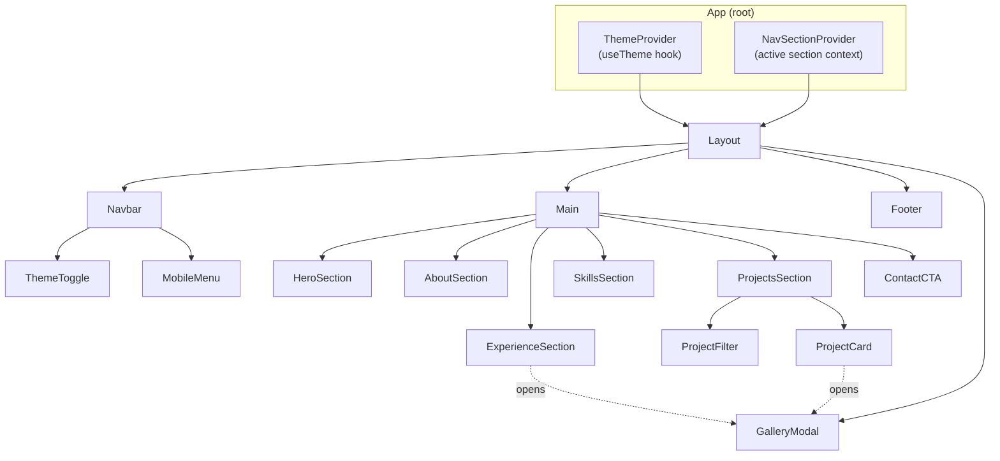
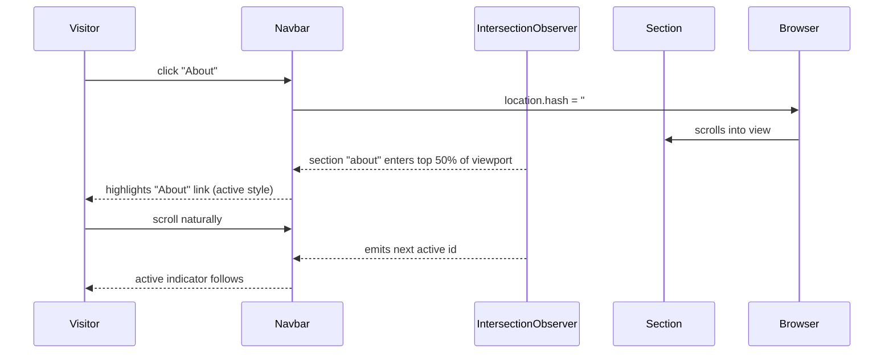
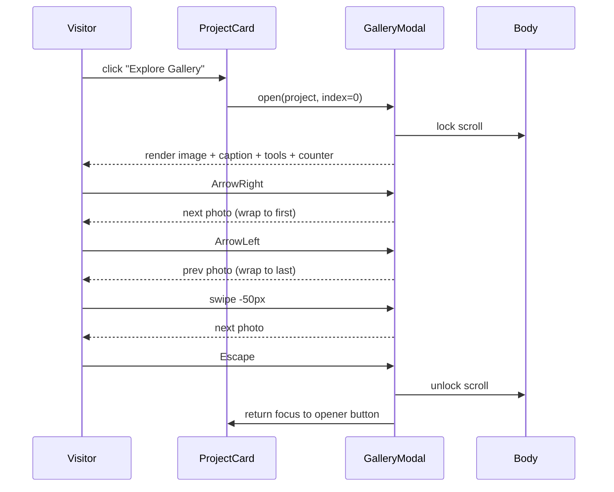

# Design Document — UI/UX Redesign

## Overview

Redesign ini adalah peningkatan front-end menyeluruh untuk Portfolio_Website Athif (single-page React app) di atas stack yang sudah ada: **React 19 + Vite 7 + TypeScript + Tailwind CSS v4 (via `@tailwindcss/vite`) + Framer Motion 12 + react-icons**. Tujuan akhirnya adalah:

1. **Konsistensi sistem desain**: token warna/tipografi/spacing/radius/motion terpusat sehingga semua section terasa berasal dari satu produk.
2. **Hierarki visual yang lebih kuat**: Hero impactful, navigasi jelas dengan active section indicator, section transitions halus.
3. **Interaksi premium tapi performant**: animasi scroll fade-in, hover yang konsisten, Gallery_Modal aksesibel (keyboard + swipe + focus trap).
4. **Responsivitas rapi 360px–1920px** dan **aksesibilitas WCAG 2.1 AA-oriented** (kontras, focus-visible, alt text, reduced-motion).
5. **Performa visual**: WebP, lazy/eager budget, dimensi gambar eksplisit untuk CLS, target LCP ≤ 2.5s.

### Constraint penting

- **Front-end only**: tidak ada backend, tidak ada perubahan data project, tetap pakai stack saat ini.
- **Refactor terkendali**: kode saat ini adalah satu file `src/App.tsx` ±895 baris yang menggabungkan navbar, hero, about, experience, skills, projects, gallery modal, dan footer. Redesign ini akan **memecahnya menjadi komponen kecil** sambil mengubah perilaku sesuai requirements (active section, focus trap, filter, dll). Data project tetap di `projectsData` (akan dipindah ke `src/data/projects.ts`).
- **Tema**: tetap memakai pendekatan kelas `dark` di `<html>` + `localStorage['color-theme']`, ditambah inisialisasi awal di `index.html` untuk hindari FOUC. Hanya nilai `light`/`dark` yang valid (Req 11.5).

### Kondisi saat ini vs target

| Aspek | Saat ini | Target redesign |
|---|---|---|
| Struktur file | 1 file App.tsx ±895 LOC | Komponen per section + hook reusable |
| Token desain | hanya `--color-accent`, `--color-dark`, `--font-handwriting` | Token lengkap warna/tipografi/spacing/radius/shadow/motion via `@theme` |
| Active nav indicator | tidak ada | IntersectionObserver untuk highlight section aktif |
| Mobile menu | tidak ada (link hilang di < md) | Sheet/drawer overlay dengan body scroll lock |
| Project filter | tidak ada | Filter chip kategori + animasi `AnimatePresence` |
| Gallery keyboard nav | hanya klik panah & swipe | + Arrow keys, Escape, focus trap, return focus |
| Lazy loading gambar | tidak konsisten | `loading="lazy" decoding="async"` + budget eager ≤ 2 |
| Reduced motion | tidak diperhatikan | `prefers-reduced-motion` mematikan blob cursor follower |
| Aksesibilitas | minim aria-label, tanpa focus-visible konsisten | aria-label lengkap, focus-visible global, alt text deskriptif |

## Architecture

### Arsitektur Tinggi (komponen)



### Ringkasan layer

1. **Design tokens** (`src/index.css` `@theme`): variabel CSS untuk warna (light + dark), font, spacing scale, radius set, shadow, dan motion preset. Tailwind v4 otomatis meng-emit utility dari token.
2. **Hooks reusable** (`src/hooks/`):
   - `useTheme()` — baca/tulis `localStorage['color-theme']`, sinkron dengan kelas `dark`, abaikan nilai invalid (Req 11.1, 11.2, 11.5).
   - `useActiveSection(sectionIds)` — IntersectionObserver dengan rootMargin yang menghasilkan section aktif berdasarkan "50% bagian atas viewport" (Req 3.2).
   - `useBodyScrollLock(locked)` — mengunci `<body>` saat modal/menu terbuka (Req 3.7, Req 9.2).
   - `usePrefersReducedMotion()` — observe `matchMedia('(prefers-reduced-motion: reduce)')` (Req 2.4, Req 13.6).
   - `useFocusTrap(ref, active)` — menjebak Tab/Shift+Tab di dalam container (Req 13.5).
3. **Komponen presentasi** per section.
4. **Data** (`src/data/projects.ts`): `projectsData` dipindah keluar dari `App.tsx` (sudah berada di luar function tapi masih di file yang sama).
5. **Modal Gallery_Modal**: top-level overlay yang menerima `project` + `initialIndex`, mengelola fokus dan keyboard.

### Struktur direktori target

```
src/
  components/
    layout/
      Navbar.tsx
      MobileMenu.tsx
      Footer.tsx
      ThemeToggle.tsx
    sections/
      HeroSection.tsx
      AboutSection.tsx
      ExperienceSection.tsx
      SkillsSection.tsx
      ProjectsSection.tsx
      ContactSection.tsx
    projects/
      ProjectCard.tsx
      ProjectFilter.tsx
    gallery/
      GalleryModal.tsx
    ui/
      SectionHeader.tsx
      Chip.tsx
      Button.tsx
      ImageWithFallback.tsx
  hooks/
    useTheme.ts
    useActiveSection.ts
    useBodyScrollLock.ts
    usePrefersReducedMotion.ts
    useFocusTrap.ts
  data/
    projects.ts
  lib/
    motion.ts        // shared motion variants
    sections.ts      // section ids + labels constant
  App.tsx
  main.tsx
  index.css
```

### Aliran interaksi: navigasi & active section



### Aliran interaksi: Gallery_Modal



## Components and Interfaces

### Design tokens (di `src/index.css` `@theme`)

Tailwind v4 menerima token via `@theme` dan otomatis mengubahnya menjadi utility (`bg-surface`, `text-fg`, `rounded-md`, `shadow-soft`, dst).

```css
@theme {
  /* Brand & accents */
  --color-brand-50:  #eefcfa;
  --color-brand-300: #5eead4;
  --color-brand-500: #2dd4bf;   /* primary accent */
  --color-brand-700: #0f766e;

  --color-violet-500: #8b5cf6;
  --color-pink-500:   #ec4899;

  /* Semantic surfaces (light) */
  --color-bg:        #f8fafc;
  --color-surface:   #ffffff;
  --color-surface-2: #f1f5f9;
  --color-fg:        #0f172a;
  --color-fg-muted:  #475569;
  --color-border:    #e2e8f0;

  /* Semantic surfaces (dark) — exposed via .dark scope */
  --color-bg-dark:        #04060d;
  --color-surface-dark:   #0f1218;
  --color-surface-2-dark: #1c212a;
  --color-fg-dark:        #e5e7eb;
  --color-fg-muted-dark:  #94a3b8;
  --color-border-dark:    rgba(255,255,255,0.08);

  /* States */
  --color-success: #22c55e;
  --color-warning: #f59e0b;
  --color-danger:  #ef4444;

  /* Typography */
  --font-sans: 'Inter', ui-sans-serif, system-ui, sans-serif;
  --font-handwriting: 'Caveat', cursive;
  --text-display: 4rem;     /* 64 */
  --text-h1: 3rem;          /* 48 */
  --text-h2: 2.25rem;       /* 36 */
  --text-h3: 1.5rem;        /* 24 */
  --text-body: 1rem;        /* 16 */
  --text-caption: 0.8125rem;/* 13 */

  /* Spacing scale (Tailwind v4 uses --spacing-*) */
  --spacing-1: 4px; --spacing-2: 8px; --spacing-3: 12px; --spacing-4: 16px;
  --spacing-6: 24px; --spacing-8: 32px; --spacing-12: 48px; --spacing-16: 64px; --spacing-24: 96px;

  /* Radius */
  --radius-sm: 6px; --radius-md: 10px; --radius-lg: 14px; --radius-xl: 20px; --radius-2xl: 28px;

  /* Shadow */
  --shadow-soft: 0 1px 2px rgba(0,0,0,.06), 0 4px 12px rgba(0,0,0,.06);
  --shadow-glow: 0 0 24px rgba(45,212,191,.25);

  /* Motion */
  --ease-out: cubic-bezier(0.22, 1, 0.36, 1);
  --duration-fast: 200ms;
  --duration-base: 350ms;
  --duration-slow: 600ms;
}

/* Apply dark surfaces under .dark scope */
.dark {
  --color-bg: var(--color-bg-dark);
  --color-surface: var(--color-surface-dark);
  --color-surface-2: var(--color-surface-2-dark);
  --color-fg: var(--color-fg-dark);
  --color-fg-muted: var(--color-fg-muted-dark);
  --color-border: var(--color-border-dark);
}

/* Color theme transition (Req 11.4) */
html.theme-transition,
html.theme-transition * {
  transition:
    background-color var(--duration-base) var(--ease-out),
    color var(--duration-base) var(--ease-out),
    border-color var(--duration-base) var(--ease-out);
}

/* Focus-visible (Req 1.6, 13.2) */
:where(a, button, [role="button"], input, textarea, select, summary):focus-visible {
  outline: 2px solid var(--color-brand-500);
  outline-offset: 2px;
  border-radius: var(--radius-md);
}
```

**Catatan**: skala spacing memetakan kelipatan 4px (Req 1.4). Radius set memenuhi {`sm`, `md`, `lg`, `xl`, `2xl`, `full`} (Req 1.5; `full` = `9999px` Tailwind built-in).

### Hooks

#### `useTheme`

```ts
type Theme = 'light' | 'dark';

function useTheme(): {
  theme: Theme;
  setTheme: (t: Theme) => void;
  toggle: () => void;
};
```

- Pada init: baca `localStorage['color-theme']`. Jika nilai bukan `'light'` atau `'dark'` → fallback ke `prefers-color-scheme` (Req 11.5).
- Setiap perubahan: tulis ke `localStorage`, tambah/hapus kelas `dark` di `<html>`, dan tambahkan kelas `theme-transition` selama 400ms untuk efek halus (Req 11.4).
- Jangan lupa hapus listener saat unmount.

#### `useActiveSection`

```ts
function useActiveSection(ids: readonly string[]): string | null;
```

- Memakai `IntersectionObserver` dengan `rootMargin: '-50% 0px -50% 0px'` sehingga section dianggap aktif ketika titik tengah viewport berada di dalamnya (memenuhi "50% bagian atas viewport"; Req 3.2).
- Mengembalikan id section aktif. Konsumer (Navbar) memetakan ke `aria-current="true"` dan styling.

#### `useBodyScrollLock`

```ts
function useBodyScrollLock(locked: boolean): void;
```

- Saat `locked === true`: simpan `document.body.style.overflow`, set jadi `'hidden'`, kompensasi scrollbar dengan `padding-right` agar konten tidak jumping. Restore saat unmount/`locked = false` (Req 3.7, Req 9.2).

#### `usePrefersReducedMotion`

```ts
function usePrefersReducedMotion(): boolean;
```

- `matchMedia('(prefers-reduced-motion: reduce)')`. Reaktif terhadap perubahan setting OS.

#### `useFocusTrap`

```ts
function useFocusTrap(
  containerRef: React.RefObject<HTMLElement>,
  active: boolean,
  options?: { initialFocusRef?: React.RefObject<HTMLElement>; returnFocusRef?: React.RefObject<HTMLElement> }
): void;
```

- Saat `active`: cari elemen fokusable, fokuskan elemen pertama (atau `initialFocusRef`), intercept Tab/Shift+Tab agar berputar di dalam container (Req 13.5).
- Saat `active` menjadi `false`: kembalikan fokus ke `returnFocusRef` (Req 9.5).

### Komponen layout

#### `Navbar`

Props:

```ts
interface NavbarProps {
  sections: { id: string; label: string }[];
  active: string | null;
  onNavigate: (id: string) => void;
}
```

- Fixed di top, full width, blur background.
- Menampilkan inline links pada `≥ md` (Req 3.4): item dengan id `=== active` mendapat indikator (underline gradient + bobot bold) dan `aria-current="true"` (Req 3.2).
- Pada `< md`: menyembunyikan inline links, menampilkan tombol hamburger (Req 3.4).
- Klik link memanggil `onNavigate(id)` yang melakukan `document.getElementById(id)?.scrollIntoView({ behavior: 'smooth', block: 'start' })`. Offset header dijaga via `scroll-margin-top` di setiap section (Req 3.3).

#### `MobileMenu`

Props:

```ts
interface MobileMenuProps {
  open: boolean;
  onClose: () => void;
  sections: { id: string; label: string }[];
  active: string | null;
  onNavigate: (id: string) => void;
}
```

- Saat `open`: render full-screen overlay dengan `min-height: 80vh` (Req 3.5), `useBodyScrollLock(true)` (Req 3.7), `useFocusTrap` aktif.
- Setiap link memanggil `onNavigate(id)` lalu `onClose()`. **Penting (Req 3.6)**: penutupan menu dan inisiasi scroll dipanggil tanpa menjamin urutan—keduanya idempotent (close = set state false, scroll = panggil scrollIntoView pada section), tidak ada efek samping bergantung urutan.
- Aria: `role="dialog"`, `aria-modal="true"`, `aria-label="Main navigation"`.

#### `ThemeToggle`

- Tombol ikon (sun/moon) dengan `aria-label="Toggle color theme"` (Req 13.4).
- Memanggil `useTheme().toggle()`.

#### `Footer` (Contact_Footer)

- Berisi headline ajakan, 3 ikon kontak (Email, LinkedIn, Instagram), CTA primer "Send Email" (`mailto:` href, Req 10.2), copyright dengan `new Date().getFullYear()` (Req 10.4), dan tombol "Back to Top" (Req 10.5).
- Pada hover di `≥ lg` (Req 10.3), ikon kontak: background berubah ke warna brand layanan (LinkedIn `#0077b5`, Instagram gradient, Email `#ef4444`), `scale: 1.1`, durasi 250ms.
- Tombol "Back to Top" memanggil `scrollIntoView({ behavior: 'smooth' })` ke `#home`.

### Komponen section

#### `HeroSection`

- Layout 2 kolom pada `≥ md` (text kiri, portrait kanan), 1 kolom pada `< md` dengan teks di atas dan portrait di bawah (Req 2.6).
- Headline: "Athif Fadheel Atharahman", role "Electrical & Software Engineer", positioning sentence (Req 2.1). Pada `≥ xl` semua tampil di atas lipatan dengan padding-top yang menampung Navbar.
- CTA primer "View My Work" (anchor `#projects`, smooth scroll) dan CTA sekunder "Let's Connect" (`href="https://www.linkedin.com/in/..."`, `target="_blank"`, `rel="noopener noreferrer"`) (Req 2.2).
- Cursor blob: state `{x, y}` diupdate via `onMouseMove` hanya ketika `window.matchMedia('(min-width: 1024px)').matches` dan `usePrefersReducedMotion() === false` (Req 2.3, 2.4, 13.6). Transition `transform 500ms ease-out` (≤ 600ms; Req 2.3).
- Portrait: `` dengan `max-h: 90vh`, `width`/`height` eksplisit (atau `aspect-ratio` CSS) untuk CLS, `loading="eager"` karena merupakan kandidat LCP (dihitung dalam budget eager ≤ 2; Req 14.3).

#### `AboutSection`

- Header section dengan judul + nama + role (Req 5.1).
- Kolom kiri: minimal 3 paragraf narasi + blok bahasa (Indonesian native, English Advanced + tautan sertifikat ECCT membuka tab baru) (Req 5.1, 5.4).
- Kolom kanan (`≥ lg`): portrait sekunder lingkaran 1:1 dengan border konsisten + Education Card (gelar, institusi, GPA) sejajar (Req 5.2, 5.3).
- Pada `< lg`: kolom mengstack vertikal tanpa overflow (Req 5.5).

#### `ExperienceSection`

Data internship PLN saat ini hard-coded; dibungkus dalam array agar urutan kronologis terbalik tetap deterministik (Req 6.2). Bentuk:

```ts
interface ExperienceEntry {
  id: string;
  range: string;          // "Jun 2025 - Aug 2025"
  startDate: string;      // ISO untuk sort (Req 6.2)
  company: string;
  role: string;
  logo: string;
  bullets: string[];      // ≥ 3 (Req 6.1)
  gallery: { url: string; caption: string }[];
}
```

- Render sorted descending oleh `startDate`.
- Galeri: grid `grid-cols-3` mobile, `md:grid-cols-5` (Req 6.3). Tile gambar: `loading="lazy" decoding="async"`, `aspect-[4/3]`.
- Hover di `≥ lg`: opacity → 100%, `scale-110` selama 400ms (Req 6.4).
- Klik tile: panggil callback `openGallery(experienceAsProject, photoIndex)`. Untuk reuse Gallery_Modal, kita memetakan setiap entri experience ke shape `ProjectData` light: `{ id, title=role, photos: gallery.map(g => ({ url: g.url, caption: g.caption, tools: company })), ... }` (Req 6.5).

#### `SkillsSection`

- Kategori: array dengan minimal 4 (current code sudah punya 7-8); setiap kategori berisi nama, ikon, warna aksen (Req 7.1).
- Grid kategori: `grid-cols-1` di `< md`, `md:grid-cols-2` di `≥ md` (Req 7.4).
- Setiap skill = chip: `{ name, icon }`. Chip `flex-wrap` agar tidak truncation pada `≥ 360px` (Req 7.5). `white-space: nowrap` di label, tapi container `flex-wrap` membuat chip pindah baris.
- Hover chip pada `≥ lg`: border ke warna aksen kategori + `box-shadow` glow konsisten (Req 7.3).

```ts
interface SkillCategory {
  id: string;
  title: string;
  accentVar: '--color-brand-500' | '--color-violet-500' | string;
  icon: ReactNode;
  skills: { name: string; icon: ReactNode }[];
}
```

#### `ProjectsSection` + `ProjectFilter` + `ProjectCard`

- Filter: deretan chip berisi kategori unik dari `projectsData.map(p => p.category)` + chip "All" di awal. State `selectedCategory` (`'All' | string`).
- `filteredProjects = useMemo(() => selectedCategory === 'All' ? projectsData : projectsData.filter(p => p.category === selectedCategory), [selectedCategory])`.
- Grid: `grid-cols-1` di `< sm`, `sm:grid-cols-2` di 640–1023, `lg:grid-cols-3` di `≥ lg` (Req 8.1).
- Animasi filter: bungkus daftar dalam `<motion.div layout>` dengan `<AnimatePresence>`, transisi opacity ≤ 400ms (Req 8.5). Item `<motion.div layout key={project.id} initial={{ opacity: 0 }} animate={{ opacity: 1 }} exit={{ opacity: 0 }} transition={{ duration: 0.3 }}>`.

`ProjectCard` props:

```ts
interface ProjectCardProps {
  project: ProjectData;
  onOpenGallery: (id: string, openerEl: HTMLElement) => void;
}
```

- Layout: thumbnail (16:9 fixed via `aspect-[16/9]`, Req 8.6), title, category badge, deskripsi (truncate ke 200 karakter, Req 8.2), tech stack chips, button "Explore Gallery (N)".
- Thumbnail: `loading="lazy" decoding="async"` (Req 8.7, 14.2).
- Hover di `≥ lg`: `translate-y: -6px`, border accent, `transition 300ms` (Req 8.3, 8.5).
- Tombol "Explore Gallery" memanggil `onOpenGallery(project.id, e.currentTarget)` agar focus dapat dikembalikan (Req 9.5).
- Gambar gagal load → `<ImageWithFallback>` menampilkan placeholder surface + ikon (Req 14.6).

### `GalleryModal`

Props:

```ts
interface GalleryModalProps {
  open: boolean;
  project: ProjectLikeForGallery | null;
  initialIndex?: number;
  openerRef?: React.RefObject<HTMLElement>;
  onClose: () => void;
}
```

State internal:
- `index`: foto aktif (init `initialIndex ?? 0`).

Perilaku:

1. **Open** (Req 9.1): saat `open && project`, render overlay full-screen dengan foto pertama (atau `initialIndex`), caption, tools, dan counter `index+1 / total` (Req 9.7).
2. **Body scroll lock** (Req 9.2): `useBodyScrollLock(open)`.
3. **Keyboard** (Req 9.3, 9.4, 9.5):
   - `ArrowRight` → `setIndex((i) => (i + 1) % total)`.
   - `ArrowLeft` → `setIndex((i) => (i - 1 + total) % total)`.
   - `Escape` → `onClose()`. Setelah close, focus dikembalikan ke `openerRef.current` melalui `useFocusTrap` `returnFocusRef` (Req 9.5).
4. **Swipe** (Req 9.6): bungkus image dalam `motion.img` dengan `drag="x"` `dragConstraints={{ left: 0, right: 0 }}` `dragElastic={0.5}`. Pada `onDragEnd`: jika `offset.x > 50` → prev (swipe ke kanan); jika `offset.x < -50` → next.
5. **Caption + Active Technologies** (Req 9.8): kedua blok membaca dari `project.photos[index]`, sehingga otomatis update saat index berubah.
6. **Aria**: `role="dialog"` `aria-modal="true"` `aria-label={project.title}`. Tombol close, prev, next punya `aria-label` (Req 13.4).
7. **Focus trap** (Req 13.5): `useFocusTrap(modalRef, open, { initialFocusRef: closeButtonRef, returnFocusRef: openerRef })`.
8. **Animasi enter/exit**: `AnimatePresence` dengan fade overlay 250ms; pada `Reduced_Motion_Mode`, fade disederhanakan tapi tidak dihilangkan total (animasi non-vestibular tetap aktif; konsisten Req 4.3).

### `ImageWithFallback`

Props:

```ts
interface ImageWithFallbackProps extends Omit<React.ImgHTMLAttributes<HTMLImageElement>, 'onError'> {
  fallback?: React.ReactNode; // default: placeholder surface + icon
}
```

- Default `loading="lazy" decoding="async"` (override jika eksplisit).
- `width`/`height` (atau `aspect-ratio` CSS) wajib (Req 14.5).
- Pada `error` → render `fallback` tanpa merusak layout (Req 14.6).

## Data Models

### `ProjectData` (existing, dipindah ke `src/data/projects.ts`)

```ts
export interface PhotoContext {
  url: string;
  caption: string;
  tools: string;
}

export interface ProjectData {
  id: string;
  title: string;
  category: string;
  thumbnail: string;
  shortDesc: string;     // ≤ 200 char (Req 8.2)
  techStack: string[];
  photos: PhotoContext[];
}
```

### `ExperienceEntry`

```ts
export interface ExperienceEntry {
  id: string;
  range: string;
  startDate: string;     // ISO date for sort
  company: string;
  role: string;
  logo: string;
  bullets: string[];     // length >= 3
  gallery: PhotoContext[]; // reuse PhotoContext for modal compatibility
}
```

### `SkillCategory`

```ts
export interface SkillItem {
  name: string;
  icon: React.ReactNode;
}

export interface SkillCategory {
  id: string;
  title: string;
  accentVar: string;     // CSS var name for hover border + glow
  headerIcon: React.ReactNode;
  skills: SkillItem[];   // grouped by category
}
```

### `Section` constant (untuk Navbar)

```ts
export const SECTIONS = [
  { id: 'home',       label: 'Home' },
  { id: 'about',      label: 'About' },
  { id: 'experience', label: 'Experience' },
  { id: 'skills',     label: 'Skills' },
  { id: 'projects',   label: 'Work' },
  { id: 'contact',    label: 'Contact' },
] as const;
```

### Theme storage

```ts
type StoredTheme = 'light' | 'dark';

const THEME_KEY = 'color-theme';

function readStoredTheme(): StoredTheme | null {
  const v = localStorage.getItem(THEME_KEY);
  return v === 'light' || v === 'dark' ? v : null; // Req 11.5: ignore invalid
}
```


## Correctness Properties

*A property is a characteristic or behavior that should hold true across all valid executions of a system — essentially, a formal statement about what the system should do. Properties serve as the bridge between human-readable specifications and machine-verifiable correctness guarantees.*

Fitur ini sebagian besar adalah UI rendering, tapi mengandung sejumlah pure-logic helper dan invariant data yang sangat layak di-PBT-kan: validasi tema, navigasi gallery, klasifikasi swipe, filter project, sort experience, kontras token, dan invariant atribut gambar. Selain itu ada satu property state-machine (body scroll lock) yang baik diuji dengan generator urutan aksi. Sisanya (layout responsif, hover, animasi durasi) lebih cocok di-cover oleh example/snapshot/integration test (lihat Testing Strategy).

### Property 1: Theme storage validation rejects non-canonical values

*For all* string `s`, `readStoredTheme()` SHALL return `s` only when `s === 'light'` or `s === 'dark'`, dan `null` untuk semua input lainnya (termasuk string acak, kosong, casing berbeda, atau angka berbentuk string).

**Validates: Requirements 11.5**

### Property 2: Theme toggle is involutive and keeps DOM/storage in sync

*For all* tema awal `T0 ∈ {'light','dark'}` dan setiap urutan `n` panggilan `toggle()` (`n ∈ ℕ`), tema final SHALL setara `T0` ketika `n` genap dan setara komplemen `T0` ketika `n` ganjil. Sepanjang seluruh urutan, invariant berikut SHALL berlaku setelah setiap pemanggilan: `document.documentElement.classList.contains('dark') === (currentTheme === 'dark')` DAN `localStorage.getItem('color-theme') === currentTheme`.

**Validates: Requirements 11.2**

### Property 3: Body-text contrast meets WCAG AA in both themes

*For all* pasangan token `(fg, bg)` yang dipakai sebagai kombinasi teks-body-on-surface di mode terang dan mode gelap, rasio kontras WCAG `contrastRatio(fg, bg)` SHALL `≥ 4.5`. Untuk setiap warna outline `focus-visible` terhadap setiap token surface (light dan dark), `contrastRatio(outline, surface)` SHALL `≥ 3`.

**Validates: Requirements 1.3, 11.3, 13.2**

### Property 4: Gallery navigation forms a cyclic bijection

*For all* `total ∈ ℕ⁺` dan `i ∈ [0, total)`, `nextIndex(i, total) = (i + 1) mod total` DAN `prevIndex(i, total) = (i − 1 + total) mod total`, sehingga `nextIndex(prevIndex(i, total), total) === i` DAN `prevIndex(nextIndex(i, total), total) === i`. Khususnya: `nextIndex(total − 1, total) === 0` dan `prevIndex(0, total) === total − 1`.

**Validates: Requirements 9.3, 9.4**

### Property 5: Swipe intent is a deterministic threshold function

*For all* `offsetX ∈ ℝ` dan threshold `t = 50`, `swipeIntent(offsetX)` SHALL mengembalikan `'next'` ketika `offsetX < −t`, `'prev'` ketika `offsetX > t`, dan `'none'` ketika `|offsetX| ≤ t`. Hasil tidak boleh bergantung state lain.

**Validates: Requirements 9.6**

### Property 6: Project filter preserves order and respects category

*For all* daftar `D: ProjectData[]` dan kategori `c ∈ {'All'} ∪ uniq(D.map(p => p.category))`, `filterByCategory(D, c)` SHALL menghasilkan list `R` yang memenuhi: (a) jika `c === 'All'` maka `R === D`; (b) jika `c !== 'All'` maka `R = [p ∈ D : p.category === c]`; (c) `R` mempertahankan urutan relatif elemen seperti pada `D` (stable filter).

**Validates: Requirements 8.4**

### Property 7: Experience entries are sorted reverse-chronologically

*For all* daftar `E: ExperienceEntry[]`, `sortByStartDateDesc(E)` SHALL menghasilkan permutasi `E'` dari `E` dengan `E'[i].startDate ≥ E'[i+1].startDate` untuk semua `i`, dan multiset elemen dipertahankan (`sort` adalah permutasi murni, bukan filter).

**Validates: Requirements 6.2**

### Property 8: Project card renders all required content and respects description bound

*For all* `p: ProjectData`, render `<ProjectCard project={p} />` SHALL mengandung: (a) teks `p.title`; (b) teks `p.category`; (c) `` dengan `src === p.thumbnail` dan `alt` non-empty; (d) untuk setiap `t ∈ p.techStack`, teks `t` muncul; (e) tombol bertuliskan `Explore Gallery` dengan jumlah foto `p.photos.length`. Tambahan: `displayedDescription(p).length ≤ 200`.

**Validates: Requirements 8.2**

### Property 9: Rendered image attributes uphold accessibility, format, and performance invariants

*For all* `` yang dirender dari `projectsData` (thumbnail + gallery photos) dan `experiencesData` (logo + gallery photos), atribut berikut SHALL terpenuhi secara bersamaan:
- `alt` adalah string yang didefinisikan; untuk gambar bermakna (thumbnail project, gallery photo, logo perusahaan, portrait) `alt.length > 0`.
- `src` berakhir dengan ekstensi modern `∈ {.webp, .png, .jpg, .jpeg, .avif}` (rekomendasi WebP).
- `loading === 'lazy'` DAN `decoding === 'async'`, kecuali untuk maksimal dua gambar bertanda eager di Hero (lihat Property 14).
- Gambar memiliki `width` + `height` eksplisit ATAU class/style `aspect-ratio`.

**Validates: Requirements 8.7, 13.1, 14.1, 14.2, 14.5**

### Property 10: Gallery_Modal display tracks the active photo index

*For all* `photos: PhotoContext[]` dengan `photos.length ≥ 1` dan setiap `i ∈ [0, photos.length)`, ketika modal terbuka pada index `i`, render-nya SHALL mengandung secara bersamaan: (a) ``; (b) teks `photos[i].caption`; (c) teks `photos[i].tools`; (d) counter dengan teks tepat `${i+1} / ${photos.length}`.

**Validates: Requirements 9.1, 9.7, 9.8**

### Property 11: Body scroll lock matches the menu/modal state machine

*For all* urutan aksi `seq ∈ {openMenu, closeMenu, openModal, closeModal}*` yang diaplikasikan ke state model `(menuOpen: bool, modalOpen: bool)` (mulai dari `(false, false)`, dengan close idempotent), setelah setiap aksi `document.body.style.overflow === 'hidden'` SHALL berlaku iff `menuOpen || modalOpen`. Setelah seluruh urutan kembali ke `(false, false)`, `overflow` SHALL sama dengan nilai aslinya sebelum lock pertama.

**Validates: Requirements 3.7, 9.2**

### Property 12: Reduced motion gates only the cursor-following blob

*For all* `(reducedMotion, isLg) ∈ {true, false}²`, `shouldAnimateBlob(reducedMotion, isLg) === (!reducedMotion && isLg)`. Untuk semua animasi non-blob (scroll fade-in section, hover skill chip, hover project card, theme transition, modal fade), `shouldAnimate(animationKind, reducedMotion) === true` untuk semua nilai `reducedMotion` (animasi non-vestibular tetap aktif).

**Validates: Requirements 2.4, 4.3, 13.6**

### Property 13: Icon-only buttons always carry a non-empty aria-label

*For all* render dari aplikasi (Navbar tertutup, MobileMenu terbuka, GalleryModal terbuka), setiap `<button>` yang dirender tanpa visible text content (yaitu `(button.textContent || '').trim() === ''`) SHALL memiliki atribut `aria-label` yang didefinisikan dengan panjang `> 0`.

**Validates: Requirements 13.4**

### Property 14: Eager image budget caps non-Hero eager images at two

*For all* render initial `<App />` (sebelum interaksi pengguna), jumlah `` di luar `#home` dengan `loading !== 'lazy'` SHALL `≤ 2`.

**Validates: Requirements 14.3**

## Error Handling

### Tema invalid di localStorage
- `readStoredTheme()` mengembalikan `null` untuk nilai non-canonical; `useTheme` jatuh balik ke `prefers-color-scheme`. Property 1 menjamin filter murni.
- Skenario: user mengubah `localStorage` manual atau ekstensi browser menulis nilai aneh — aplikasi tidak crash, tema tetap konsisten.

### Gambar gagal dimuat
- `<ImageWithFallback>` menangkap `onError`, mengganti node menjadi placeholder bertema (surface + ikon "image-off"). Layout tidak bergeser karena `width`/`height` (atau `aspect-ratio`) eksplisit (Req 14.5, 14.6).
- Untuk thumbnail project yang hilang, kartu tetap utuh dan tombol "Explore Gallery" tetap berfungsi.

### `framer-motion` gagal dimuat
- Setiap section pembungkus motion menerapkan strategi defensive default: pada katagori SSR/initial state, opacity dan transform diatur sehingga jika library gagal mounting, komponen tetap terlihat (`opacity:1, translateY:0`) (Req 4.5). Tidak ada konten yang tergantung pada selesainya animasi untuk menjadi visible.

### `IntersectionObserver` tidak tersedia
- `useActiveSection` melakukan feature detect; jika `IntersectionObserver` tidak ada (browser sangat lawas), hook mengembalikan `null` dan Navbar tidak menampilkan indikator aktif tetapi link tetap dapat diklik. Tidak ada fitur lain yang rusak.

### `prefers-reduced-motion` tidak didukung
- `usePrefersReducedMotion()` default ke `false` jika `matchMedia` tidak didukung. Animasi blob tetap aktif (graceful degradation, bukan kebalikan).

### Perangkat tanpa hover (touch only)
- Semua interaksi yang dipicu hover (overlay foto, glow chip) memiliki versi visible by default pada touch. Tombol "Explore Gallery" selalu visible. Tidak ada konten yang hanya dapat diakses lewat hover.

### Modal dibuka/ditutup berulang dengan cepat
- `useBodyScrollLock` menggunakan reference counter sederhana (atau `cleanup` per effect) sehingga `body.style.overflow` selalu kembali ke nilai asli setelah semua locker rilis. Property 11 menutupi invariant ini.

### Keyboard di GalleryModal: focus loop
- `useFocusTrap` memastikan Tab/Shift+Tab tidak keluar modal (Req 13.5). Saat modal close, fokus dikembalikan ke opener (atau `<body>` sebagai fallback bila opener telah unmount).

## Testing Strategy

### Pendekatan campuran (sesuai klasifikasi prework)

| Kategori | Tool | Fokus |
|---|---|---|
| Property-based unit tests | **fast-check** + **Vitest** + **@testing-library/react** | Property 1–14 |
| Example-based unit tests | Vitest + @testing-library/react + jsdom | Komponen render spesifik, navigasi keyboard, focus trap, error fallback |
| Snapshot/SMOKE config tests | Vitest | Token CSS hadir, font links, breakpoints, durasi animasi |
| Integration / E2E | **Playwright** | Responsivitas 360–1920px, no horizontal scroll, touch target ≥ 44px, axe-core a11y, IntersectionObserver real |
| Performance | **Lighthouse CI** (atau manual Chrome DevTools) | LCP ≤ 2.5s, CLS ≤ 0.1, FPS ≥ 50 |
| Visual regression (opsional) | Playwright screenshot diff | Hover state, focus-visible, layout sections |

### Pemilihan PBT library

- **fast-check** dipilih karena: (a) satu-satunya PBT library mainstream untuk TypeScript/JavaScript yang aktif dipelihara; (b) integrasi mulus dengan Vitest (`it.prop`/`fc.assert(fc.property(...))`); (c) shrinking otomatis. **Tidak menulis PBT dari nol.**

### Konfigurasi PBT

- **Minimum 100 iterasi per property** (`fc.assert(prop, { numRuns: 100 })` atau `it.prop` default; eksplisit di config jika perlu).
- **Tag setiap property test** dengan komentar mengikuti format wajib:
  - `// Feature: ui-ux-redesign, Property 1: Theme storage validation rejects non-canonical values`
- File test diletakkan dekat sumber: `src/hooks/__tests__/useTheme.test.ts`, `src/components/projects/__tests__/ProjectCard.test.tsx`, dst.

### Pemetaan test → property (ringkas)

| Property | Generator / fixture | Implementasi inti |
|---|---|---|
| P1 | `fc.string()` (termasuk string acak, kosong, "Light", "DARK", "0") | `expect(readStoredTheme(s)).toBe(s === 'light' \|\| s === 'dark' ? s : null)` |
| P2 | `fc.constantFrom('light','dark')` × `fc.array(fc.boolean(), 0..20)` (toggle sequence) | step model; assert class & storage |
| P3 | `fc.constantFrom(...tokenPairs)` (pairs derived dari token map untuk light/dark) | `chroma.contrast(fg, bg) >= 4.5` (memakai library `wcag-contrast` ringan) |
| P4 | `fc.integer({min:1,max:50})` (total) × `fc.integer({min:0})` (i) | uji `nextIndex`/`prevIndex` round-trip + boundary |
| P5 | `fc.integer({min:-1000,max:1000})` (offsetX) | uji `swipeIntent` |
| P6 | `fc.array(arbProject)` × `fc.option(fc.constantFrom(...categories))` | uji `filterByCategory` |
| P7 | `fc.array(arbExperience, 0..10)` | uji `sortByStartDateDesc` |
| P8 | `arbProject` (id/title/category/desc/techStack/photos/thumbnail dengan generator string + arbWebpUrl) | render `<ProjectCard>`, query semua field, `expect(displayedDesc.length).toBeLessThanOrEqual(200)` |
| P9 | `arbProject` + `arbExperience` (dataset acak); ALSO data-driven dengan dataset asli | render kartu/tile, `screen.getAllByRole('img')`, assert atribut |
| P10 | `fc.array(arbPhoto, 1..20)` × `fc.integer({min:0})` mod length | render `<GalleryModal>`, assert caption/tools/counter |
| P11 | `fc.array(fc.constantFrom('openMenu','closeMenu','openModal','closeModal'), 0..30)` | model state + assert `body.style.overflow` invariant |
| P12 | `fc.boolean()` × `fc.boolean()` | uji `shouldAnimateBlob`; tabel kebenaran; assert non-blob tetap aktif |
| P13 | render aplikasi pada beberapa state (default, mobile menu open, gallery open) | scan all `<button>`, filter yang `textContent.trim() === ''`, assert `aria-label` |
| P14 | render `<App />` | `screen.getAllByRole('img')` minus yang berada di `#home`; count `loading !== 'lazy'`; `expect(count).toBeLessThanOrEqual(2)` |

### Example-based unit tests (highlight)

- **Hero CTA**: render Hero, klik "View My Work" → `scrollIntoView` dipanggil dengan `#projects` dan `behavior: 'smooth'`; klik "Let's Connect" → anchor punya `target="_blank" rel="noopener noreferrer"`.
- **Mobile menu**: render `<App />` pada viewport 360px, hamburger visible & inline links hidden; klik hamburger → menu open & `body.overflow === 'hidden'`; klik link → menu close.
- **Theme toggle**: render, toggle, assert `<html>` mendapat/kehilangan kelas `dark` dan `localStorage` sinkron (juga ditutupi P2, tapi versi example lebih cepat untuk regression).
- **Gallery keyboard**: render modal, fire `ArrowRight`/`ArrowLeft`/`Escape`; assert index berubah dan `Escape` mengembalikan fokus ke opener.
- **Focus trap**: render modal dengan ≥ 3 fokusable element, tab dari last → first; shift+tab dari first → last (Req 13.5).
- **Image fallback**: render `<ImageWithFallback src="/missing.webp">`, fire `error`; assert fallback rendered dan `getBoundingClientRect` punya tinggi sama dengan render sukses.
- **framer-motion fail**: vitest `vi.mock('framer-motion', () => ({ motion: throwingProxy, AnimatePresence: passthrough }))` → render section, assert teks tetap visible (Req 4.5).

### SMOKE / config tests

- Token tertentu hadir di `src/index.css` (regex match): `--color-brand-500`, `--color-bg`, `--color-fg`, `--color-fg-muted`, `--color-border`, `--color-success`, `--color-warning`, `--color-danger`, `--font-handwriting`, `--radius-{sm,md,lg,xl,2xl}`, `--spacing-{1,2,3,4,6,8,12,16,24}`, `--duration-base` ≤ 400ms.
- `index.html` memuat tepat 2 font family (Inter, Caveat) (Req 1.2).
- Motion variant section: `duration ∈ [0.3, 0.7]` dan `y ≤ 40` (Req 4.1); `viewport={{ once: true }}` (Req 4.2).
- Aspect ratio thumbnail card: class `aspect-[16/9]` (atau `aspect-[4/3]`) (Req 8.6).

### Integration / E2E (Playwright)

1. **Responsif 360–1920px** (Req 12.1): untuk lebar `[360, 414, 768, 1024, 1280, 1536, 1920]`, navigasi seluruh section dan assert `document.documentElement.scrollWidth ≤ window.innerWidth`.
2. **Touch target** (Req 12.3): pada lebar 360px, kumpulkan semua `[role=button], button, a` yang visible; assert `boundingRect.width ≥ 44 && boundingRect.height ≥ 44`.
3. **Active section indicator** (Req 3.2): scroll ke `#about`, `#experience`, dst; assert link aktif ber-`aria-current="true"`.
4. **Smooth scroll & offset** (Req 3.3): klik link → tunggu scroll selesai → assert top section ≥ 0 dan tidak tertutup navbar (`section.getBoundingClientRect().top >= navbarHeight - 1`).
5. **axe-core a11y scan** (Req 13.3): `@axe-core/playwright` di setiap section utama dan saat modal terbuka; tidak ada `serious`/`critical` violations.
6. **Reduced motion** (Req 13.6, 2.4): emulate `prefers-reduced-motion: reduce`; assert blob style tidak update saat mouse bergerak; tetapi class fade-in section tetap `opacity:1` setelah dalam viewport.

### Performance (Lighthouse CI)

- Build production (`vite build`) → serve → run Lighthouse pada `mobile` profile dengan throttling `Slow 4G`.
- Assert `LCP ≤ 2500ms` (Req 14.4), `CLS ≤ 0.1` (Req 14.5), kategori Performance ≥ 85.

### Catatan PBT

- **PBT TIDAK diterapkan** untuk: layout responsif (visual), durasi/easing animasi (sudah cukup dengan SMOKE/snapshot), keyboard reachable (axe-core integration), LCP/CLS (Lighthouse).
- **PBT diterapkan** untuk: pure functions (theme validation, navigation arithmetic, swipe intent, filter, sort, contrast, animate-gate), data invariants (image attributes pada dataset tergenerate maupun nyata), state-machine invariant (body scroll lock), dan render-property dengan dataset acak (project card content, modal display, icon-only aria-label, eager budget).
- Setiap property test memakai dataset hibrida: 100 iterasi atas data tergenerate via fast-check **plus** satu run "data-driven" atas dataset asli (`projectsData`, `experiencesData`) untuk menutup regresi konten nyata.
